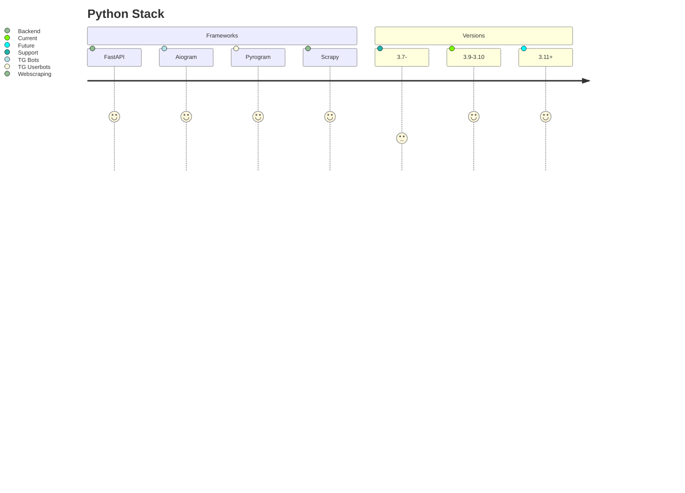
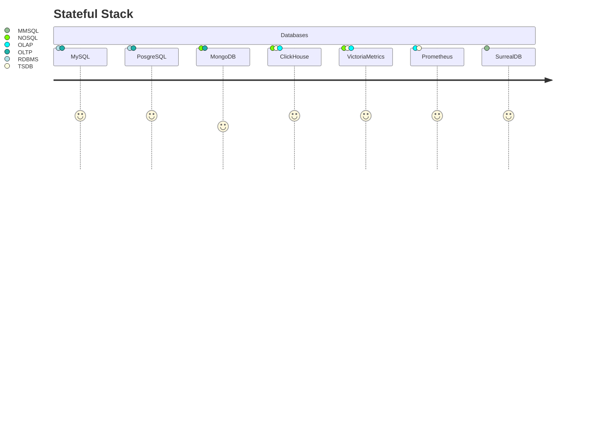
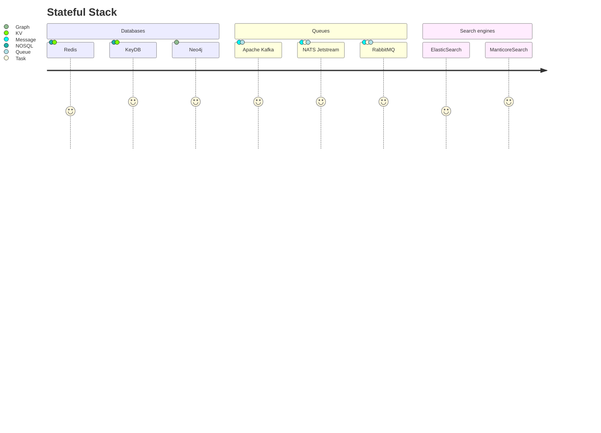
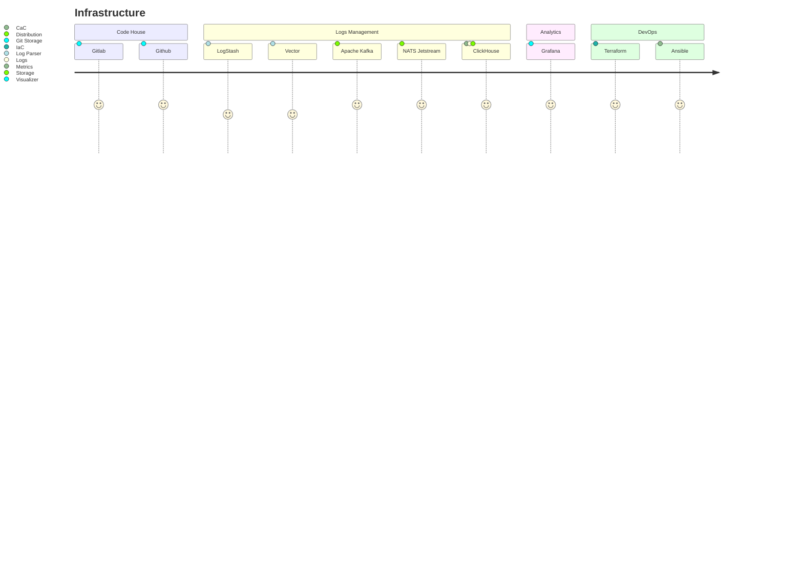
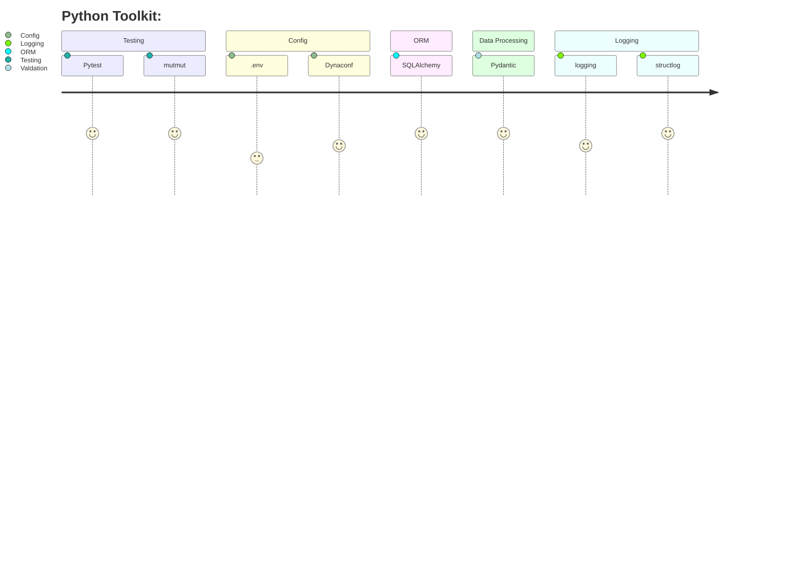

## Hello! I am Aleksandr [**@AbstractiveNord**](https://t.me/AbstractiveNord) Antonov ✋  
 

🐍Python ⌨️ Backend Developer, 🖥 DevOps Engineer and 🌐 Systems Architector
⚙️Rust Embedded & WebAssembly Frontend Developer

 

 

---

---

---

